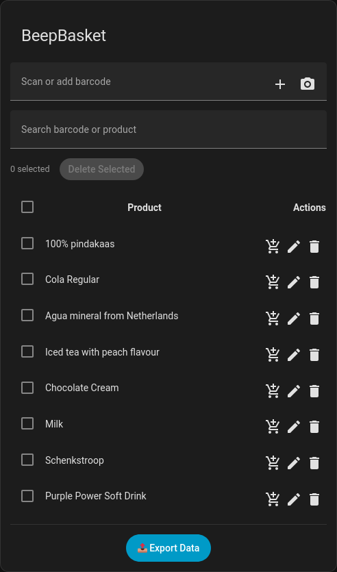
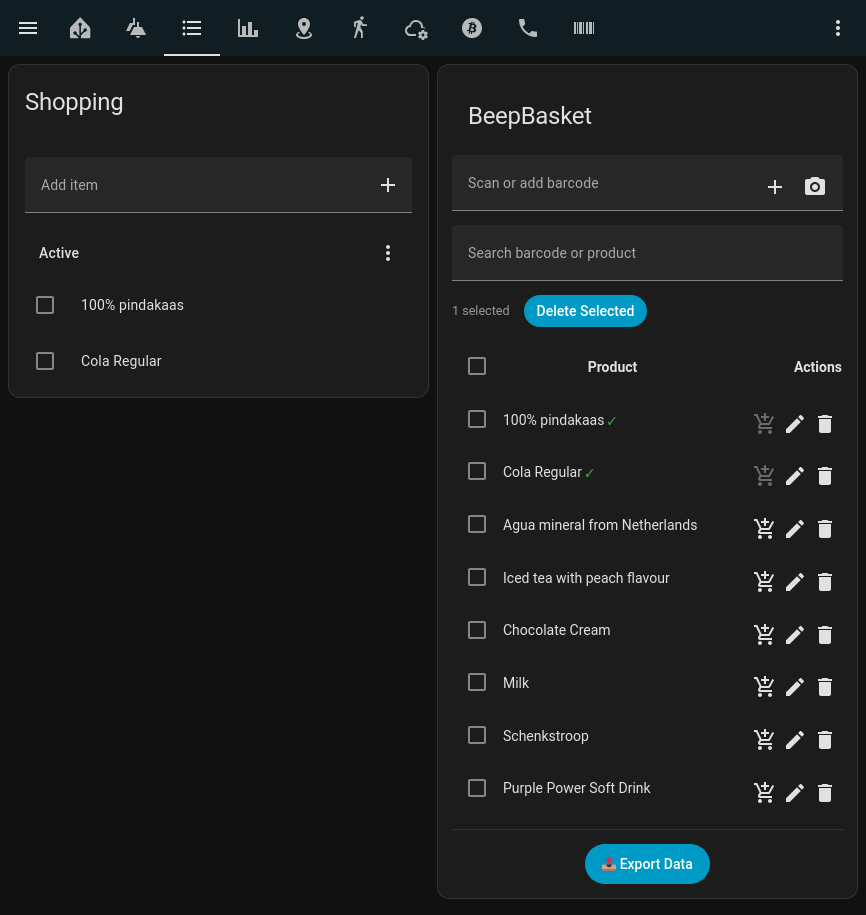
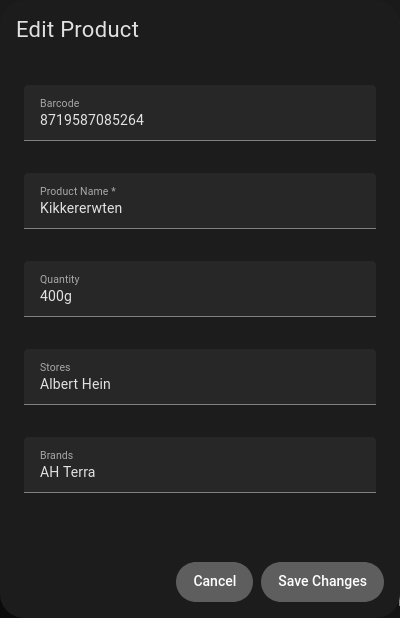
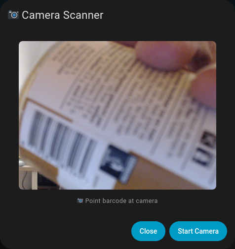

# BeepBasket 

**Beep barcodes straight into your shopping basket!**

## Features
- Instant barcode → shopping list  
- OpenFoodFacts auto-lookup
- Local product cache (JSON)
- Custom UI card (`beepbasket-card`)
- Dustbin sensor support

## Usage
```
type: "custom:beepbasket-card"
```

## Screenshots
### Card

Simple interface



### Items added

Items added to you shopping list also checked on your BeepBasket




### Edit added

Directly edit unknown items 




### Camera support

Scan directly from your device




## Project details

https://hackaday.io/project/204783-beepbasket